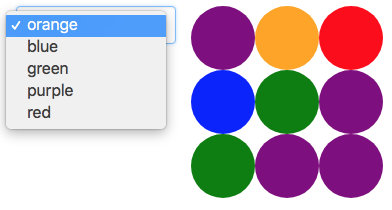

Dit jaar zal er voor het project van het opleidingsonderdeel Scriptingtalen een JavaScript applicatie geschreven worden die het mogelijk maakt om bepaalde grid games die in Python geïmplementeerd zijn te visualiseren. Als voorbeeld zullen we het spel uit de evaluatieoefening [gekleurde druppels](https://dodona.ugent.be/nl/courses/62/exercises/476763735/) gebruiken, maar het is de bedoeling dat er makkelijk andere spellen geïmplementeerd kunnen worden.

# Opgave

Het project bestaat uit twee delen.

- Een Python gedeelte dat de logica van het spel implementeert
- Een JavaScript gedeelte dat de visualisatie implementeert

Het Python script zal worden uitgevoerd als een CGI-script (meer uitleg hierover vind je onder extra informatie) en zal communiceren met de JavaScript applicatie door JSON (JavaScript Object Notation) objecten door te sturen.

Voor de acties die verband houden met het spelen van het spel leggen we de structuur van het JSON-object vast. Er zijn 3 mogelijke sleutels. Een sleutel `board` met als value een twee dimensionale lijst die de bordconfiguratie beschrijft. Ieder element van deze lijst is de naam van een [css kleur](https://www.w3schools.com/cssref/css_colors.asp). Verder kan het JSON object ook nog een sleutel `moves` bevatten die de huidige mogelijke zetten bevat, een sleutel score die als waarde een integer heeft, en een sleutel `message` die een mogelijk bericht bevat dat aan de gebruiker getoond moet worden.

Hieronder vind je een voorbeeld van zo'n JSON object.

```
{
    board: [["purple", "orange", "red"], ["blue", "green", "purple"], ["green", "purple", "purple"]],
    moves: ["orange", "blue", "green", "purple", "red"],
    score: 0,
    message: ''
}
```

De situatie van het spel horende bij dit object kan gevonden worden in onderstaande figuur. Rechts zie je de configuratie van het bord en links de mogelijke zetten.



# Python gedeelte

Voor het Python gedeelte moet er een CGI-script geschreven worden dat verplicht de volgende functies bevat.

- Een functie `new_game` die een dictionary teruggeeft die het JSON-object voorstelt dat hoort bij een nieuw, random gegenereerd bord. Deze functie heeft een optionele parameter `size` (standaardwaarde 5) die de grootte van het bord bevat.
- Een functie `do_move` die 3 verplichte parameters heeft, de eerste is een dictionary die de huidige status van het spel weergeeft, de tweede is de zet die wordt uitgevoerd en de derde parameter is een tuple die de rij- en kolomindex van het vak waarop de zet wordt uitgevoerd bevat (bij het "Gekleurde Druppels"-spel is dit altijd de bol in de linkerbovenhoek). Deze functie geeft een dictionary terug die de nieuwe status van het spel omschrijft.

# JavaScript gedeelte

Het JavaScript gedeelte bevat de visualisatie. Schrijf hiervoor een webpagina die minstens volgende elementen bevat.

- Een visualisatie van de huidige toestand van het bord
- Een dropdown menu waar je een mogelijke zet kunt selecteren
- Een knop waarmee je een nieuw spel kunt starten
- Een label dat de huidige score weergeeft

Wanneer er op het juiste vak op het bord geklikt wordt, moet de zet die momenteel geselecteerd is uitgevoerd worden op dat vak en de HTML pagina aangepast worden zodat die de nieuwe configuratie van het spel weergeeft. Doe dit door de functies in het Python CGI-script aan te roepen.

Wanneer het teruggestuurde JSON-object een sleutel `message` bevat, moet deze ook gepast weergegeven worden aan de gebruiker.

Je kan [hier](http://users.ugent.be/~dmouriss/gekleurde_druppels.html) een video van een voorbeeld bekijken.

# Extra informatie

1. Introductie tot CGI

Een korte introductie tot CGI kan gevonden worden in [deze dodona oefening](https://dodona.ugent.be/nl/exercises/317308934/) uit Computergebruik.

2. Python CGI server

  Het is mogelijk om met Python een lokale webserver op te zetten die CGI ondersteunt. Dit kan helpen als je je CGI script lokaal wil testen. Hiervoor voer je het commando `python -m CGIHTTPServer` uit via de commandolijn van je OS. Dit zal een webserver opstarten in de huidige directory waar je kunt naartoe surfen via `localhost` op poort 8000 (http://localhost:8000`). Meer informatie hierover vind je [hier](http://www.johnloomis.org/python/cgiserver.html).

3. Python en CGI

  Python heeft een ingebouwde CGI library die je kunt importeren via `import cgi`. Deze kan onder andere gebruikt worden om de parameters die meegegeven werden aan het script op te vragen. Hiervoor kun je gebruik maken van de functie `FieldStorage` uit de cgi library die een parameter object teruggeeft. Het voorbeeld hieronder gaat ervan uit dat het script is opgeroepen met een GET parameter breedte die de waarde 4 bevat.

  ```python
  >>> import cgi
  >>> parameters = cgi.FieldStorage()
  >>> parameters.getvalue('breedte')
  4
  ```

  4. CGI op je UGent webruimte

  Meer info hierover kan je vinden op de [website](http://helpdesk.ugent.be/webhosting/cgi.php) van de UGent helpdesk.

  5. Javascript en CGI

  Bekijk zeker eens de documentatie over de [JavaScript Fetch API](https://developer.mozilla.org/en-US/docs/Web/API/Fetch_API/Using_Fetch).

  # Deadline

De deadline van het project is **vrijdag 18 mei** om **22.00**, indienen gebeurt via een speciaal aangemaakt [indianio](http://indianio.ugent.be) project. Als je je applicatie schrijft volgens de opgave is het zeer eenvoudig om naast het "Gekleurde druppels"-spel een tweede spel te implementeren door een tweede Python script te schrijven. Dit is niet verplicht, maar zou wel een leuke meerwaarde aan je project zijn als je tijd over hebt.

Extra vragen kunnen altijd gesteld worden via github issues. Er is hiervoor een label `project` aangemaakt.
